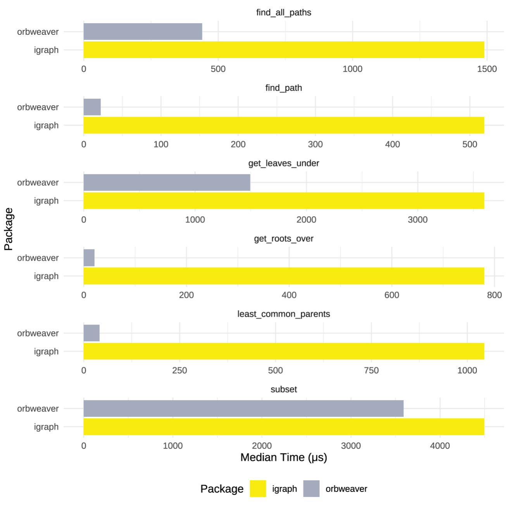

<!-- README.md is generated from README.Rmd. Please edit that file -->

# orbweaver <a></a>

<!-- badges: start -->

[](https://cran.r-project.org/package=orbweaver)
[](https://github.com/ixpantia/orbweaver/actions/workflows/check-full.yaml)
[](https://github.com/ixpantia/orbweaver-r/actions/workflows/R-CMD-check.yaml)
<!-- badges: end -->

## Overview

A fast R library for working with Nodes in a graph.

## Features

- Find shortest paths between nodes in a graph
- Find the common parents between selected nodes
- Directed Graph
- Directed Acyclic Graph
- It is quite fast

## Why not igraph?

[igraph](https://igraph.org/) is an amazing network analysis package.
igraph is much more mature and orbweaver focuses on extreme performance
and low latency operations. If you need super high performance and do
not require weighted graphs, orbweaver may be for you.



> We may add weighted graph in the future but for not it is not in the
> short-term road map.

## Installation

### Rust Toolchain

Before installing this package, you will need to install the Rust
toolchain.

#### Mac or Linux

If you are on Mac or Linux, you can do this by running the following
command in your terminal:

``` bash
curl --proto '=https' --tlsv1.2 -sSf https://sh.rustup.rs | sh
```

#### Windows

If you are on Windows, you can download the installer from
[here](https://www.rust-lang.org/tools/install).

In order to compile this package manually, you will need the **GNU ABI**
used by the **GCC toolchain**. This is not the default on Windows, so
you will need to install the toolchain manually. You can do this by
running the following command in your terminal:

``` bash
rustup toolchain install stable-gnu
```

If you are on Windows you may need to install `Rtools` as well. You can
download the installer from
[here](https://cran.r-project.org/bin/windows/Rtools/).

### R Package

You can install orbweaver from CRAN with:

``` r
install.packages("orbweaver")
```

You can install orbweaver from GitHub with:

``` r
# install.packages("remotes")
remotes::install_github("ixpantia/orbweaver-r")
```

## Example

``` r
library(orbweaver)

edges <- data.frame(
  parent = c("A", "B", "C", "C", "F"),
  child  = c("B", "C", "D", "E", "D")
)

graph <- graph_builder() |>
  populate_edges(edges, "parent", "child") |>
  build_directed()

graph
#> # of nodes: 6
#> # of edges: 5
#> # of roots: 2
#> # of leaves: 2
#> 
#> |     Parent      |      Child      |
#> | --------------- | --------------- |
#> | A               | B               |
#> | B               | C               |
#> | C               | E               |
#> | C               | D               |
#> | F               | D               |

graph |> find_all_paths(from = "A", to = "D")
#> [[1]]
#> # of nodes: 4
#> |           Nodes           |
#> |             A             |
#> |             B             |
#> |             C             |
#> |             D             |
```
